<h1 align="center">Hi 👋, I'm Jheysonn Gil</h1>

<h4 align="justify">Colombian passionate about developing applications and web pages, focused on teamwork and work efficiency. I am currently a graduate of the Henry Bootcamp where I acquired various technical skills and improved my soft skills for professional development.</h4>
<h4 align="justify">In each project in which I cooperate with a team, I usually try to create an environment of equality with my colleagues, I also implement help spaces when someone from the team has difficulties and later teach the resolution of the said difficulty. I like teamwork and job integration, active and passive communication, in addition to promoting new ideas and facing new challenges to grow as a professional and above all as a person.</h4>

<h3 align="center">⚡ Languages and Tools ⚡</h3>

  
  
  
  
  
  
  
  

  

  
  
  
  
  
  
  
  

 

<h3 align="center">📞 Would you like to contact with me? 📞</h3>
<h4 align="center">Email 📧: <a href="mailto:jheysonnm@gmail.com">jheysonnm@gmail.com</a></h4>
<h4 align="center">LinkedIn ☑️: <a href='https://www.linkedin.com/in/jheysonn-gil-646672237/' target='_blank'>jheysonn-gil-646672237</a></h4>

 

<h1 align="center">💻 My Projects 💻</h1>

 

<h2 align="center">🕹 3XTREM GAM3S 🕹</h2>

  
  
  
  
  
  
  
  
  
  
  
  
    

<h4 align="justify">This web page was a requirement as an Individual Project from Henry's bootcamp, here I used all my skills acquired in the modules, like making a database from scratch, connecting it to the back-server, then sending all info to the front using React, making everything functional and attractive.</h4>

<h3 align="center">📷 Some Images 📷</h3>

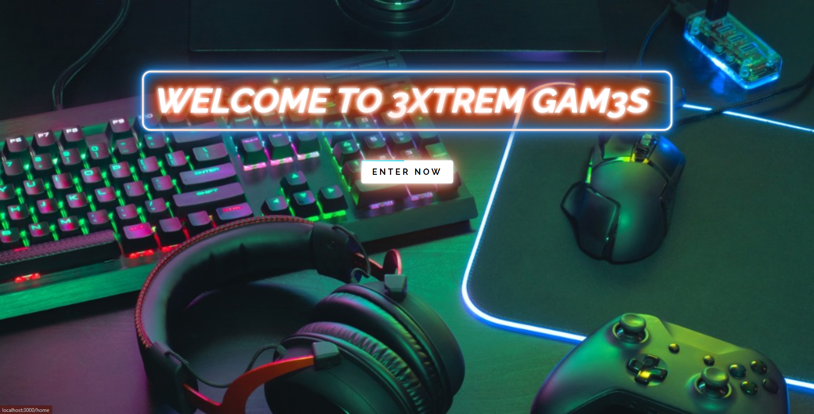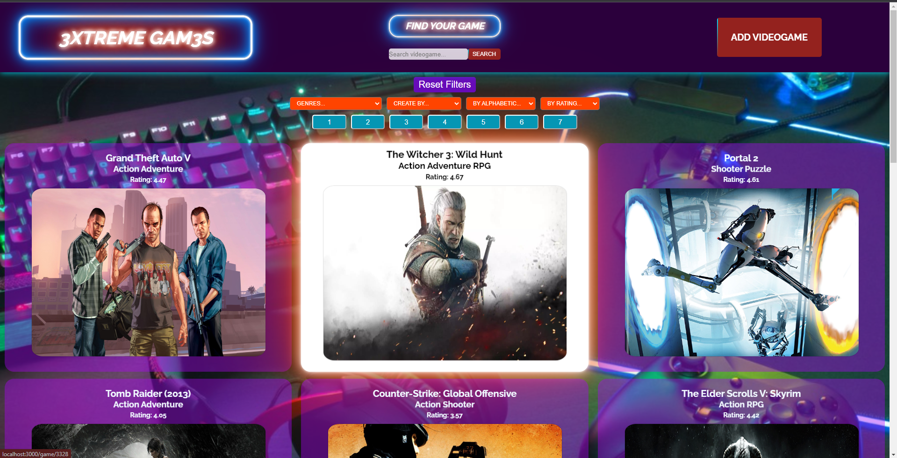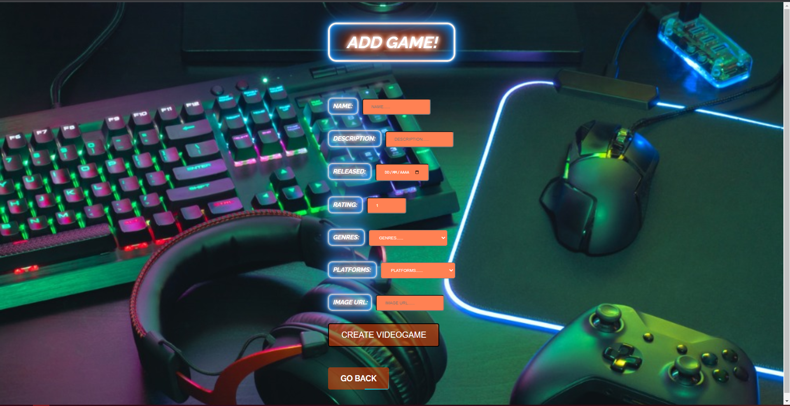

<a href='https://github.com/rennemetter/PI-Videogames'>📔 Repository 📔</a> 
Deploy Comming Soon

 

<h2 align="center">🎻 Script Music 🎻</h2>

  
  
  
  
  
  
  
  
  
  
  
  
  
  
  
  

<h4 align="justify">This is a group project done with 7 other members whose main goal was to pass Henry's bootcamp. The Scrum methodology was used for the development where my participation focused on the coordination of the team, personal unification, creation of functionalities in the backend, the system of effective payment and storage of purchases, implementation of Cloudinary for the management of images and the creation of the database, among other activities.</h4>

<h4 align="justify">The presented project arises from the need to provide a solution to have a better stock control together with the sales of musical instruments for a distributor of the same, and also enter the company into the virtual market, allowing greater comfort for the purchase and sale of instruments. Having a comfortable and useful administrator panel from the web, we also provide great comfort for the client by having a mobile application in which to review the available products along with offers and make purchases with the simple movement of the finger. Stripe was implemented as a means to facilitate payments.</h4>

<h3 align="center">📷 Some Images 📷</h3>

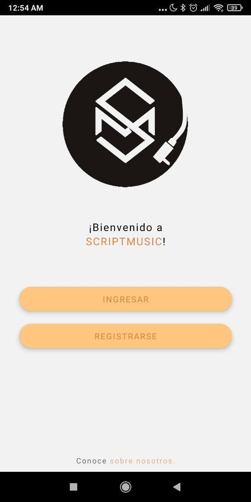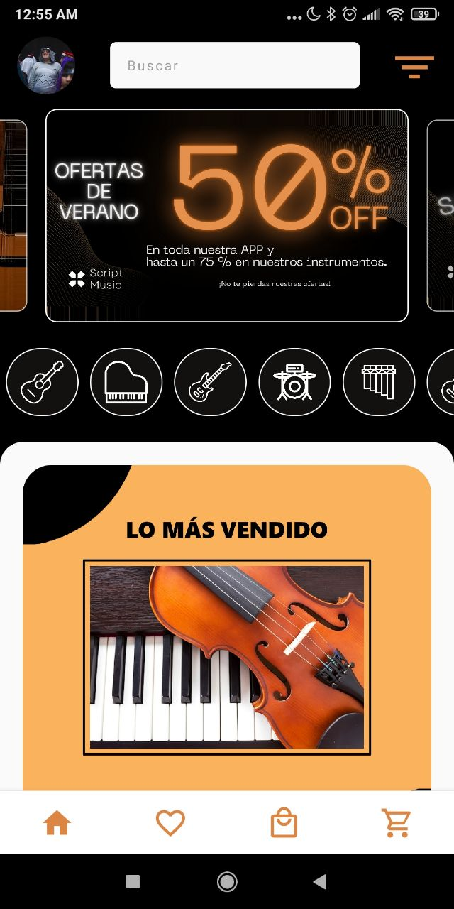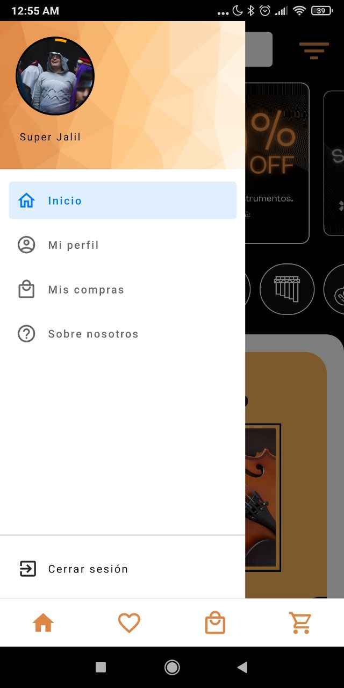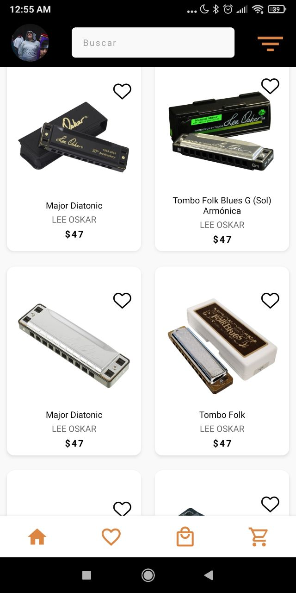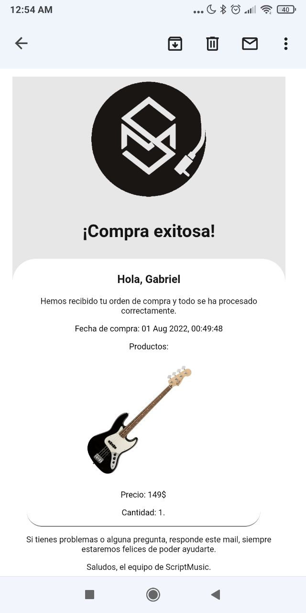

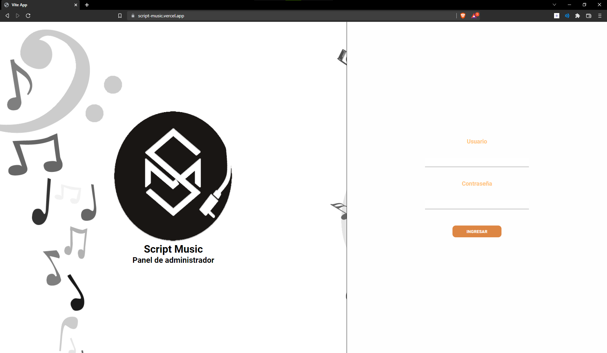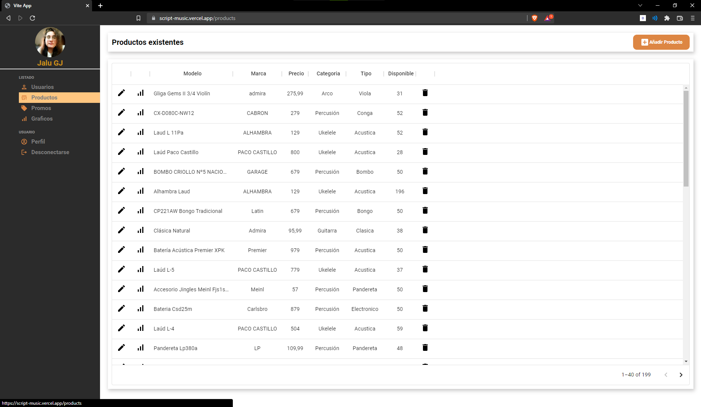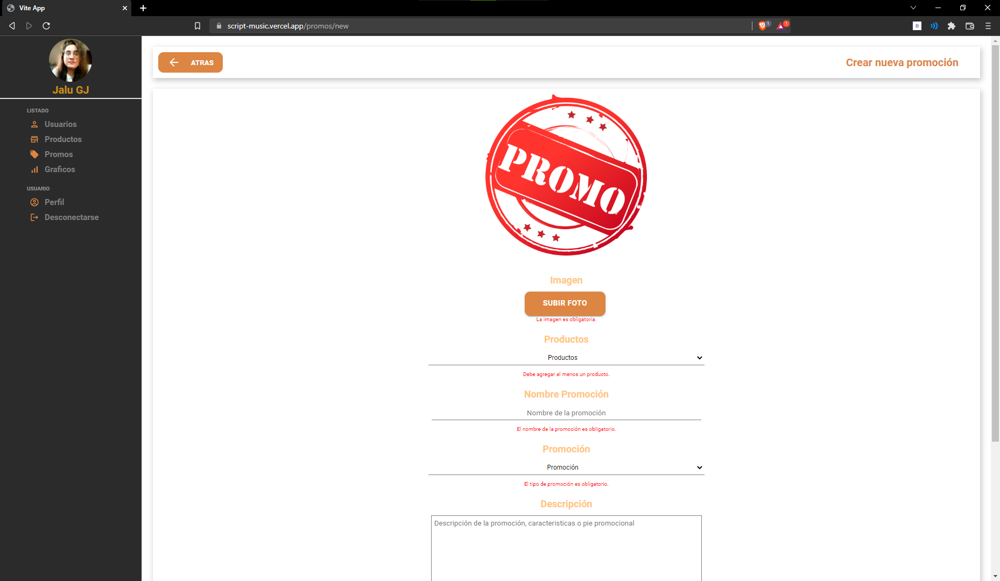

<a href='https://github.com/rennemetter/ScriptMusic'>📔 Repository 📔</a> <a href='https://mega.nz/file/55A1kLpB#qRea9x096wFu1YwWxxHtmXYUK0-0ZwYgGgCTxb3fYwg'>📲 Download App 📲</a>

<h3 align="center">🎥 Video Presentation 🎥</h3>

<!--
**rennemetter/rennemetter** is a ✨ _special_ ✨ repository because its `README.md` (this file) appears on your GitHub profile.

Here are some ideas to get you started:

- 🔭 I’m currently working on ...
- 🌱 I’m currently learning ...
- 👯 I’m looking to collaborate on ...
- 🤔 I’m looking for help with ...
- 💬 Ask me about ...
- 📫 How to reach me: ...
- 😄 Pronouns: ...
- ⚡ Fun fact: ...
-->
